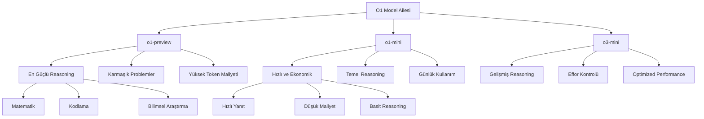
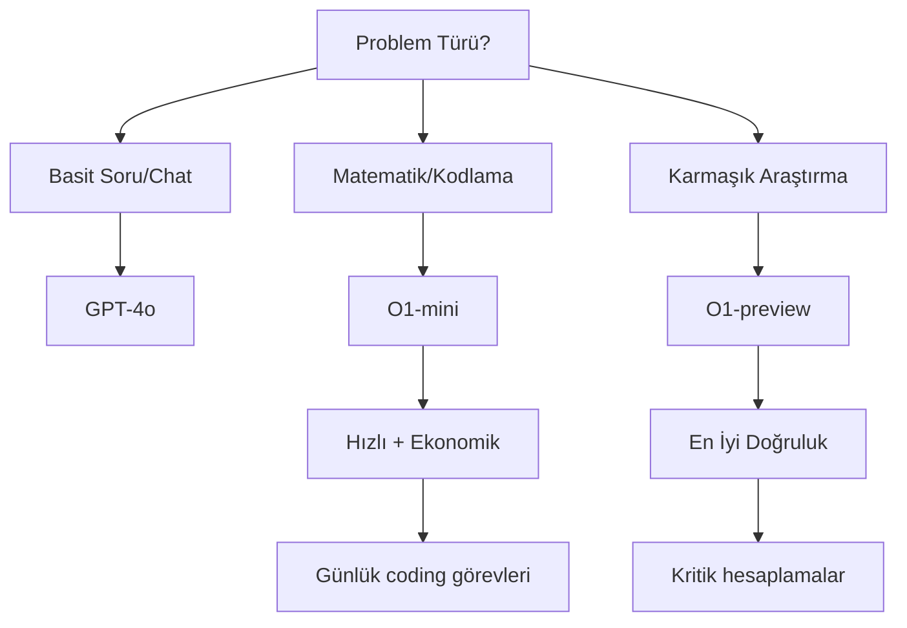

## O1 Model Ailesi - Yeni Nesil Reasoning Modeller

**O1 model ailesi**, OpenAI'nin en son geliştirdiği ve **reasoning (akıl yürütme)** yetenekleri konusunda devrim yaratan model serisidir. Bu modeller, karmaşık problemleri çözmek için daha fazla zaman harcayarak, adım adım düşünme ve problem çözme yetenekleri sunmaktadır. O1 modelleri, özellikle matematik, kodlama, bilim ve mantık gerektiren görevlerde üstün performans gösterir.



## O1 Modellerinin Temel Özellikleri

### 🧠 **Reasoning (Akıl Yürütme) Yetenekleri**

O1 modelleri, geleneksel GPT modellerinden farklı olarak **internal reasoning** süreci geçirmektedir. Bu süreçte model:

* **Adım adım düşünme**: Problemi parçalara bölerek her adımı analiz eder
* **Self-correction**: Kendi hatalarını fark ederek düzeltme yapar  
* **Deep analysis**: Yüzeysel yanıtlar yerine derinlemesine analiz yapar
* **Mathematical reasoning**: Matematik problemlerinde üstün performans gösterir

### 📊 **Reasoning Tokens**

O1 modelleri, yanıt üretirken **reasoning tokens** kullanır. Bu tokenlar:

* Model'in düşünme sürecini temsil eder
* Kullanıcıya gösterilmez ancak faturalandırılır
* `ReasoningTokenCount` ile takip edilebilir
* Toplam `OutputTokenCount` içerisinde yer alır

### ⚡ **Model Çeşitleri**

| Model | Özellik | Kullanım Alanı | Maliyet |
|-------|---------|----------------|---------|
| **o1-preview** | En güçlü reasoning | Karmaşık matematik, araştırma | Yüksek |
| **o1-mini** | Hızlı ve ekonomik | Günlük görevler, basit coding | Orta |
| **o3-mini** | Gelişmiş + effor kontrolü | Optimize edilmiş performans | Değişken |

## O1 Modellerinin Kullanım Alanları

### 🔬 **Bilimsel Araştırma ve Akademik Çalışmalar**

* Karmaşık matematik problemlerinin çözümü
* Bilimsel makalelerin analizi ve yorumlanması
* Hipotez oluşturma ve test etme
* Veri analizi ve istatistiksel hesaplamalar

### 💻 **Yazılım Geliştirme ve Kodlama**

* Algoritma tasarımı ve optimizasyonu
* Kod hata ayıklama (debugging)
* Karmaşık sistem mimarisi tasarımı
* Code review ve kalite analizi

### 🎯 **Problem Çözme ve Karar Verme**

* Çok kriterli karar analizi
* Risk değerlendirmesi
* Stratejik planlama
* Optimizasyon problemleri

## .NET ile O1 Modellerini Kullanma

### Adım 1: Temel Kurulum

```csharp
using OpenAI.Chat;

// O1 modeli için ChatClient oluşturma
ChatClient client = new("o1-preview", apiKey);
```

### Adım 2: O1 Modeli için Özel Seçenekler

```csharp
// O1 modelleri için özelleştirilmiş seçenekler
ChatCompletionOptions options = new()
{
    MaxOutputTokenCount = 4000,  // o1 için max_completion_tokens
    // Not: o1 modelleri system mesajlarını desteklemez
    // Not: streaming henüz desteklenmez
};
```

### Adım 3: Reasoning Tokens Takibi

```csharp
List<ChatMessage> messages = [
    new UserChatMessage("Bu denklemi çöz: 2x² + 5x - 3 = 0")
];

ChatCompletion completion = client.CompleteChat(messages, options);

// Reasoning token kullanımını kontrol etme
if (completion.Usage?.OutputTokenDetails?.ReasoningTokenCount.HasValue == true)
{
    Console.WriteLine($"Reasoning Tokens: {completion.Usage.OutputTokenDetails.ReasoningTokenCount}");
    Console.WriteLine($"Display Tokens: {completion.Usage.OutputTokenCount - completion.Usage.OutputTokenDetails.ReasoningTokenCount}");
    Console.WriteLine($"Total Output Tokens: {completion.Usage.OutputTokenCount}");
}

Console.WriteLine($"Çözüm: {completion.Content[0].Text}");
```

## Reasoning Effort (Akıl Yürütme Efor) Kontrolü

O3-mini ve yeni O1 modelleri için **reasoning effort** kontrolü yapabilirsiniz:

### ReasoningEffortLevel Kullanımı

```csharp
ChatCompletionOptions options = new()
{
    ReasoningEffortLevel = ChatReasoningEffortLevel.Medium // Low, Medium, High
};

List<ChatMessage> messages = [
    new UserChatMessage("Bu karmaşık matematik problemini çöz...")
];

ChatCompletion completion = client.CompleteChat(messages, options);
```

### Effort Seviyelerinin Etkileri

| Seviye | Hız | Doğruluk | Token Kullanımı |
|--------|-----|----------|-----------------|
| **Low** | Hızlı | Orta | Az |
| **Medium** | Orta | İyi | Orta |
| **High** | Yavaş | Çok İyi | Fazla |

## Developer Messages (O1 için Sistem Mesajları)

O1 modelleri geleneksel `SystemChatMessage` desteklemez. Bunun yerine `DeveloperChatMessage` kullanın:

```csharp
List<ChatMessage> messages = [
    new DeveloperChatMessage("Sen bir matematik uzmanısın. Problemleri adım adım çöz."),
    new UserChatMessage("Şu denklemi çöz: 3x + 2 = 14")
];

ChatCompletion completion = client.CompleteChat(messages);
```

## Kapsamlı Örnek: Matematik Problem Çözücü

```csharp
using OpenAI.Chat;
using System;
using System.Collections.Generic;

namespace OpenAI.Examples
{
    public class O1MathSolver
    {
        public static void Example_O1_MathProblemSolver()
        {
            // API anahtarını config'den oku
            string apiKey = ConfigReader.ReadApiKeyFromConfig();
            
            if (string.IsNullOrEmpty(apiKey))
            {
                Console.WriteLine("API anahtarı bulunamadı.");
                return;
            }

            // O1-preview modeli ile ChatClient oluştur
            ChatClient client = new("o1-preview", apiKey);

            // Developer message ile sistem talimatları
            List<ChatMessage> messages = [
                new DeveloperChatMessage(@"
                    Sen bir matematik uzmanısın. Problemleri şu şekilde çöz:
                    1. Problemi analiz et
                    2. Hangi yöntemi kullanacağını belirle  
                    3. Adım adım çözüm yap
                    4. Sonucu doğrula
                    5. Alternatif çözüm yolları varsa belirt
                "),
                new UserChatMessage(@"
                    Aşağıdaki matematik problemini çöz:
                    
                    Bir şirket, aylık satışlarının %15'ini reklam harcamalarına ayırıyor.
                    Bu ay toplam 120.000 TL satış yaptılar ve reklam harcamaları
                    geçen aya göre %20 arttı. Geçen ay reklam harcamaları
                    ne kadardı?
                ")
            ];

            // O1 modeli için özel seçenekler
            ChatCompletionOptions options = new()
            {
                MaxOutputTokenCount = 2000
            };

            try
            {
                Console.WriteLine("Problem çözülüyor... (O1 modeli düşünüyor)");
                
                ChatCompletion completion = client.CompleteChat(messages, options);

                // Reasoning token kullanımını göster
                if (completion.Usage?.OutputTokenDetails?.ReasoningTokenCount.HasValue == true)
                {
                    Console.WriteLine("\n=== TOKEN KULLANIMI ===");
                    Console.WriteLine($"🧠 Reasoning Tokens: {completion.Usage.OutputTokenDetails.ReasoningTokenCount}");
                    Console.WriteLine($"💬 Display Tokens: {completion.Usage.OutputTokenCount - completion.Usage.OutputTokenDetails.ReasoningTokenCount}");
                    Console.WriteLine($"📊 Total Output Tokens: {completion.Usage.OutputTokenCount}");
                    Console.WriteLine($"📥 Input Tokens: {completion.Usage.InputTokenCount}");
                }

                Console.WriteLine("\n=== ÇÖZÜM ===");
                Console.WriteLine(completion.Content[0].Text);

            }
            catch (Exception ex)
            {
                Console.WriteLine($"Hata oluştu: {ex.Message}");
            }
        }
    }
}
```

## O1 Modelleri ile İlgili Dikkat Edilmesi Gerekenler

### ⚠️ **Kısıtlamalar**

1. **Streaming desteği yok**: O1 modelleri henüz streaming API'yi desteklemiyor
2. **System mesajları yok**: `SystemChatMessage` yerine `DeveloperChatMessage` kullanın
3. **Function calling sınırlı**: Araç çağrıları kısıtlıdır
4. **Yüksek maliyet**: Reasoning tokenlar ek maliyete sahiptir

### 💡 **En İyi Pratikler**

1. **Kompleks problemler için kullanın**: Basit görevler için geleneksel modeller yeterli
2. **Effort level'ı ayarlayın**: Hız vs doğruluk dengesini kurun
3. **Token kullanımını takip edin**: Reasoning tokenları izleyin
4. **Clear instructions verin**: Developer message ile net talimatlar verin

### 🔄 **Model Seçimi Rehberi**



## Performans Karşılaştırması

| Görev Türü | GPT-4o | O1-mini | O1-preview |
|-------------|---------|---------|------------|
| Matematik | ⭐⭐⭐ | ⭐⭐⭐⭐ | ⭐⭐⭐⭐⭐ |
| Kodlama | ⭐⭐⭐⭐ | ⭐⭐⭐⭐ | ⭐⭐⭐⭐⭐ |
| Hız | ⭐⭐⭐⭐⭐ | ⭐⭐⭐⭐ | ⭐⭐⭐ |
| Maliyet | ⭐⭐⭐⭐ | ⭐⭐⭐ | ⭐⭐ |
| Reasoning | ⭐⭐ | ⭐⭐⭐⭐ | ⭐⭐⭐⭐⭐ |

O1 model ailesi, özellikle **düşünme gerektiren** görevlerde oyunun kurallarını değiştiren bir teknoloji sunmaktadır. .NET geliştiricileri için bu güçlü yetenekleri kullanarak daha akıllı ve etkili uygulamalar geliştirmek mümkün hale gelmiştir.

[Kod örnekleri için GitHub repository'sini ziyaret edebilirsiniz.](https://github.com/KardelRuveyda/openai-dotnet-exercises)
